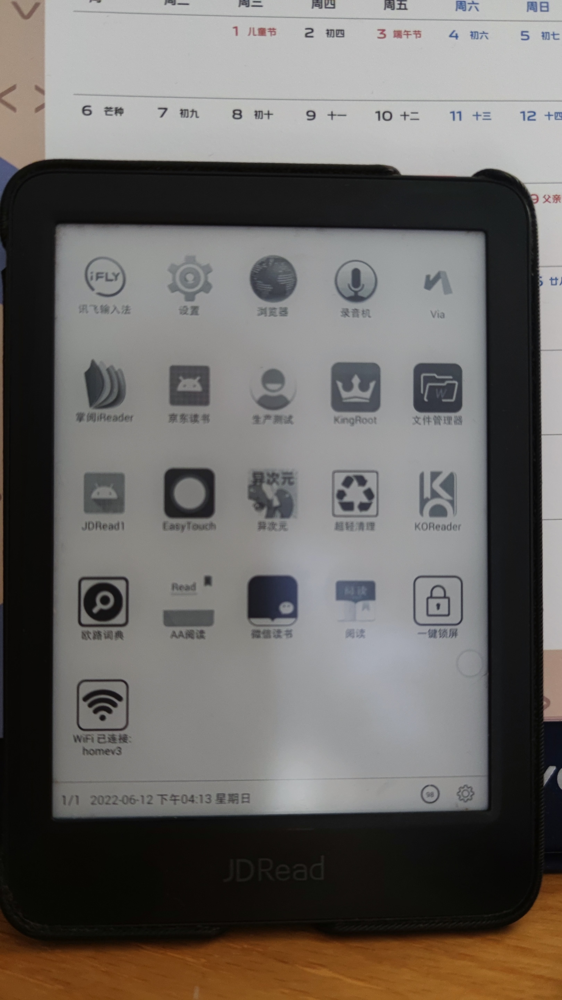

+++
date = '2022-06-12T21:07:20+08:00'
draft = true
title = 'JDRead的root与新生'
featured_image = 'c430d079bea91a86b8bf0e63ceffa7b2810bbdaf.jpg'
tags =['root','JDReader']
categories = ['编程']
+++

前言：JDRead作为京东自研发的电子墨水阅读器，当年以捆绑京东plus赠送读书会员的方法吸引了很多人购买，但是随着Kindle的退出中国市场，似乎大家也是不怎么爱读书呀。

作为压泡面的神器，root之后可以让其重新发光发热。

<!--more-->

工具：jdread1助手、KingRootSetup（下载链接： https://pan.baidu.com/s/11qfiZxgpGXgN4UBfL8pUew?pwd=fthb 提取码: fthb ）

步骤：

1、打开JDRead的WIFI，并连接

2、把JDRead的密码设计为0423，手机号码填写自己的手机号码

3、点击设备信息，快速连续点击系统版本（大概10来次），会显示已经开启开发者权限

4、在电脑上安装kingroot，然后使用usb线把JDRead连接到电脑上。（此时如果无法顺利连接，有可能时驱动等各种问题，参与刷机的前置工作。趣闻：JDRead刚连接上电脑后，就显示应用宝要安装到JDRead的申请，看来是有什么东西在一直监听着。）

5、打开kingroot，点击connect，然后点击root。漫长的等待后，就完成root了。（注意：过程中杀毒软件可能显示有木马病毒，请点击本次允许进行放行）

6、成功root后打开jdread1助手，这是一个bat脚本。依次输入0、1、2、3进行安装root后的必须app（例如桌面、文件管理器、悬浮球等）。至于6、7按个人喜好是否进行替换，还可以编辑对应的zip文件进行自定义。

7、最后输入9进行重启，完成所有工作。（拔USB线了）

使用感受：

非常感谢各路网友的努力破解，这真是一个技术活。

root后增加了浏览器、微信读书等很方便使用，至于速度还能接收，不要干频繁刷新的事，毕竟只是个Reader读书器啊，不是平板电脑。

首次重启后，务必先打开悬浮球（easyTouch），不然进入其他应用后，可能无法返回桌面，只能重启。

笔者通过更换屏保后，Reader重生为一个电子展示相册（通过锁屏屏保），这也给笔者一个多看Reader一眼的机会吧（笑）。

 

jdread1助手更新进度：https://yiniot.com/archives/53/#%E5%B0%8F%E7%99%BD%E6%95%99%E7%A8%8B
