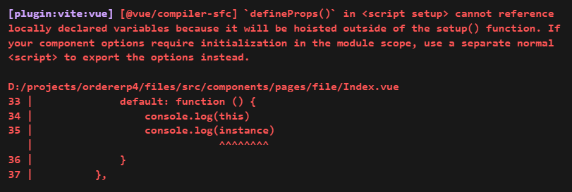

+++
date = '2022-07-28T10:00:00+08:00'
draft = true
title = 'Vue 3: `defineProps` are referencing locally declared variables'
featured_image = '3fe1b8a62829e24bc61cc32db22b5edc978f3cdb.png'
categories = ['编程']
tags = ['vue3']
toc= true
+++

## 错误内容如下：
``` bash
[plugin:vite:vue] [@vue/compiler-sfc] `defineProps()` in <script setup> cannot reference locally declared variables because it will be hoisted outside of the setup() function. If your component options require initialization in the module scope, use a separate normal <script> to export the options instead. 
```
<!--more-->


今天遇到一种情况，在setup script 里定义了props,而props里的一个属性是一个方法，想定义一个默认的方法。默认的方法里要用到this(instance)或者props本身，但是怎么写都会出现上图的警告。

不得了，搜索了一下。这个问题似乎是vue本身引起，代码的逻辑的思维是没有问题。那么记录一下错误的原因：

当我们使用script setup的时候，其实是编译器帮我们把代码编译回去setup的方法，类似我们在defineComponent里写setup方法，所以setup本身是一个独立的作用域（setup scope）。

而vue组件本身是一个js文件，也就是script方法里也是一个作用域(module scope)。

也就是说一个vue组件其实同时具备了两个作用域。

因此，在defineProps里定义default函数的时候不应该引用setup作用域的变量。

因为props本身应该是属于module scope，跟setup是同级的。

props与setup之间的关系
明白了原因之后，就可以找到解决的办法。

首先是错误的代码：
``` js
<script setup>
  const sizes = ['sm', 'md']

  const props = defineProps({
    size: {
      type: String,
      validator: val => sizes.includes(val) // <= Can't reference `sizes`
    }
  })
</script>
```
## 解决办法1：

import引用的时候，变量是定义在module scope的，因此在同一个作用域。
``` js
<script setup>
import { sizes } from './sizes' // <= import it

const props = defineProps({
  size: {
    type: String,
    validator: val => sizes.includes(val) // <= use it
  }
})
</script>
```

## 解决办法2：

把变量定义在script里，这样也是定义在module scope上。

``` js
<script setup>
const props = defineProps({
  size: {
    type: String,
    validator: val => sizes.includes(val) // <= sizes from module scope
  }
})
</script>

<script>
const sizes = ['sm', 'md'] // <= sizes can be accessed in setup scope

export default {}
</script>
```


结语：setup script是一个极好的语法糖，提高了语法效率，但是因此引起的作用域问题会让新人感觉优点莫名其妙。而这些问题往往在官网上是没有详细的记录。最后只能靠大家写下来的资料。但是，如果对作用域的理解没有到位，可能会感觉到有点莫名其妙。如果不理解作用域，只是使用解决办法的话，后面恐怕写代码时又会遇到问题，不能随心所欲。因此，这个问题本身是作用域的问题，希望遇到同样问题的小伙伴们，好好理解一下作用域本身。 