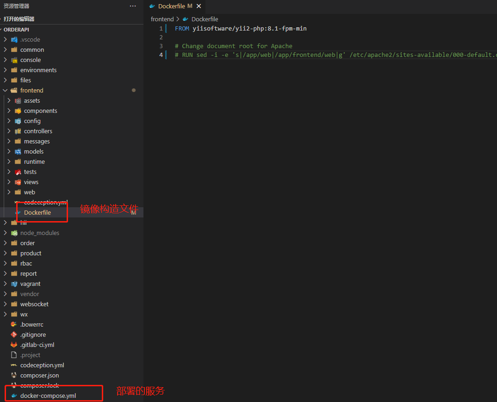

+++
date = '2022-07-01T20:41:01+08:00'
draft = false
title = 'Yii2使用官方docker方案'
featured_image = ''
categories = ['编程']
tags= ['Yii']
toc= false
+++

Yii2是拥有自家的docker解决方案的，但是国内的资料甚少。可能是因为官方镜像出的比较晚，国内大部分是使用私人的镜像。其实，官方的镜像一直在维护，不过名气不大，dockerhub的下载数也只有5K+。

<!--more-->

## 优点

使用官方镜像的优点，肯定就是拿来即用。但是如果跟不上官方程序员的思维估计也是用不上，因为官方的资料很少，文档也很简单基本都是英文。

以下是YII中国的介绍，也是寥寥数字。看了也没有搞明白。

https://www.yiichina.com/doc/guide/2.0/tutorial-docker

官方镜像目前在维护的版本是php 7.4  -- 8.1,省去了调试php的版本问题。镜像内带的php插件也是很丰富的，在官方dokcer上还有扩展一些常用扩展的例子（ https://github.com/yiisoft/yii2-docker/blob/master/docs/install-extensions.md ）。

## 简要使用方法

1. 安装docker环境

2. 安装docker compose。注意：目前最新版本是V2.6.1(发布地址： https://github.com/docker/compose/releases )。a.使用脚本安装，请务必修改版本号，不然安装的是V2.4.1。代码如下：
``` shell
curl -L https://get.daocloud.io/docker/compose/releases/download/v2.4.1/docker-compose-`uname -s`-`uname -m` &gt; /usr/local/bin/docker-composeb.  
``` 
授权执行权限：
``` shell
sudo chmod +x /usr/local/bin/docker-composec.创建软连接sudo ln -s /usr/local/bin/docker-compose /usr/bin/docker-composed.
```
测试是否成功  
``` shell
docker-compose --version
```
参考地址：https://m.runoob.com/docker/docker-compose.html

3. 准备好一个YII2的项目。如图：



编辑根目录的docker-compose.yml，这里定义了启动服务的依赖和先后顺序，默认是启动

frontend、backend、mysql 三个服务，请根据个人情况进行调节，ports映射端口请自行调整。

其中build字段指的是服务构建时Dockerfile文件的目录，如上图会在frontend文件夹内找到，默认使用的是yiisoftware/yii2-php:7.2-apache，php版本较低，请自行修改（查看镜像标签地址： https://github.com/yiisoft/yii2-docker ）。

4. 在当前目录执行

``` shell
docker-compose up -d
```

执行后，会自行创建出docker-compose.yml上对应的镜像和运行服务。

5. 进入镜像内进行composer install和php init初始化项目。也可以直接在外层直接初始化。代码会被映射到镜像内的/app文件夹。


至此完成。